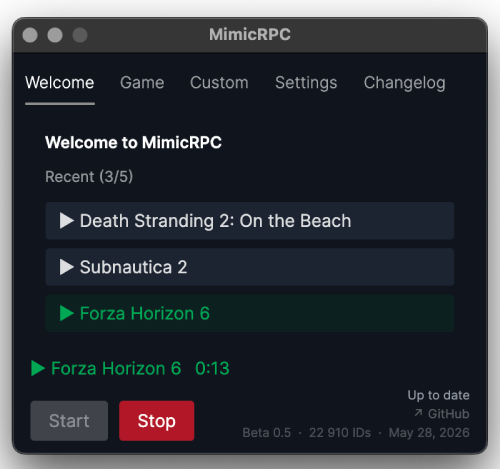

# MimicRPC

Cross-platform (Windows, Linux, macOS) app that fakes any game as your Discord activity using Discord's own app IDs. Ships with ~23k game IDs.

> **Warning:** Won't work for Discord quests.

**Built with** - [.NET 10](https://dotnet.microsoft.com), [Avalonia 11](https://avaloniaui.net), [discord-rpc-csharp](https://github.com/Lachee/discord-rpc-csharp)

> **Warning:** The app is not code-signed so Windows SmartScreen and macOS Gatekeeper will warn you.

- On Windows: click "More info" → "Run anyway".
- On macOS: right-click the app → Open → Open, or go to **System Settings → Privacy & Security** and click **"Open Anyway"** next to the blocked app.

## Download

Download the latest release from the [Releases page](../../releases) - pick the file for your platform.

> **Note:** Linux builds are less tested than macOS. If something doesn't work, open an issue.

No HAR file needed to run the app - the bundled list is enough. A fresh HAR is only needed if you want an up-to-date game list.

## Updating the game list

1. Open Discord in a browser, open DevTools → Network tab
2. Log in or browse around
3. Export as HAR, save as `discord.har` next to `extract_db.sh`
4. Run `./extract_db.sh`

---

Game database: ~23k IDs - last updated May 28, 2026
